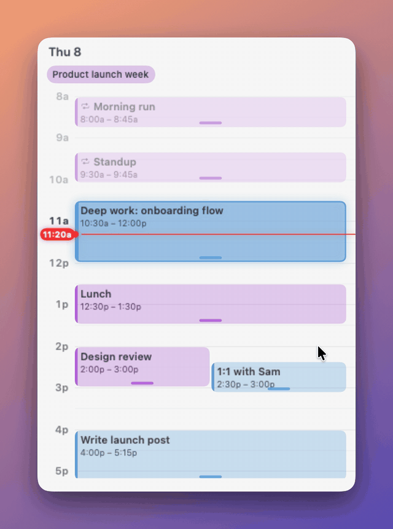

# HeyDay

A small macOS desktop widget that shows your [HEY Calendar](https://www.hey.com/calendar/) day as a timeline. It sits on the desktop (or floats above windows) and talks to HEY through the official [`hey` CLI](https://www.hey.com/agents/).

<p align="center"></p>

## Features

- Day timeline with a live "now" line and the current event highlighted
- Drag on empty space to create an event, or double-click for a quick one
- Drag events to move them, drag the bottom edge to resize, double-click to rename, right-click to delete
- Repeating events: edits apply to that day's occurrence only
- All-day events in a strip under the header
- Browse days with the arrows (hover the header); **Today** jumps back
- Cached days and background prefetch of the neighbouring days, so switching is instant
- Settings: target calendar, time zone, double-click length, hour height, visible hours (e.g. 8a–5p), float above windows

## Requirements

- macOS 13 or later
- Xcode Command Line Tools (`xcode-select --install`) for `swiftc`
- A HEY account and the `hey` CLI

## Setup

1. Install the `hey` CLI:

   ```sh
   curl -fsSL https://hey.com/install-cli | bash
   ```

   Or with Go: `go install github.com/basecamp/hey-cli/cmd/hey@latest`

2. Sign in. The first run of `hey` walks you through browser authentication (or run `hey setup` / `hey login` any time). Check it worked:

   ```sh
   hey auth status
   hey calendar list
   ```

3. Build and install HeyDay:

   ```sh
   git clone https://github.com/yazinsai/hey-widget.git
   cd hey-widget
   ./build.sh install
   ```

   This builds `HeyDay.app`, copies it to `~/Applications`, adds it to your login items and launches it. Use `./build.sh` alone to just build into `build/`.

HeyDay looks for `hey` in `$HEY_PATH`, `~/go/bin`, `/opt/homebrew/bin`, `/usr/local/bin`, then your `PATH`. If yours lives elsewhere, set `HEY_PATH` to the full path of the binary.

## Usage

- Drag the header to move the widget; resize from the window edges.
- Hover the header for day navigation and the settings gear.
- The menu bar icon has Refresh, Settings and Quit.
- A red dot next to the date means the last `hey` call failed; hover it for the error, click to dismiss.

New events go to your **Personal** calendar by default; pick another in Settings.

### Demo mode

`HEYDAY_DEMO=1` shows sample events with the clock pinned to 11:20 (no `hey` calls). Add `HEYDAY_SNAPSHOT=out.png` to write a 2x PNG of the window and quit — that's how `docs/screenshot.png` is made:

```sh
HEYDAY_DEMO=1 HEYDAY_SNAPSHOT=$PWD/docs/screenshot.png ./build/HeyDay.app/Contents/MacOS/HeyDay
swift scripts/desktop-shot.swift docs/screenshot.png docs/screenshot-desktop.png
```

The second command places it on a generated desktop.

`scripts/demo-gif.sh` renders `docs/demo.gif`: with `HEYDAY_RECORD=dir` the app plays a scripted session (drag-create, type, resize, switch days) using synthetic input and writes each frame, then ffmpeg turns them into a GIF. Needs ffmpeg and ImageMagick.

## License

[MIT](LICENSE)
